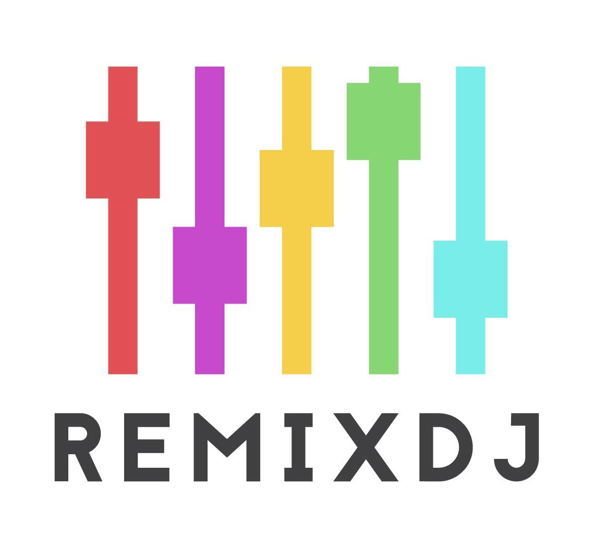
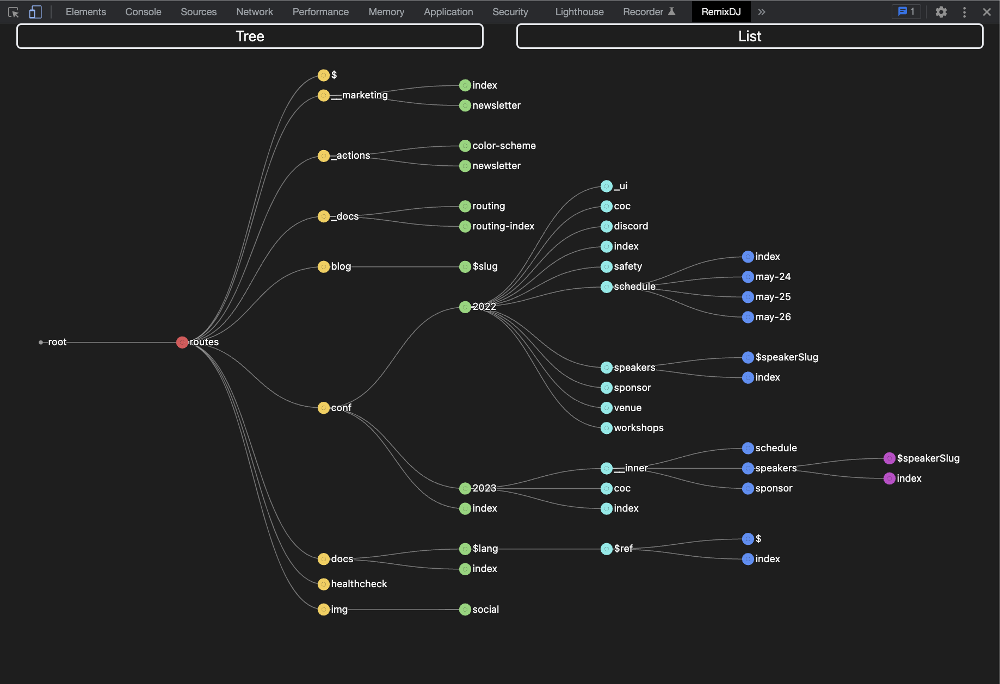
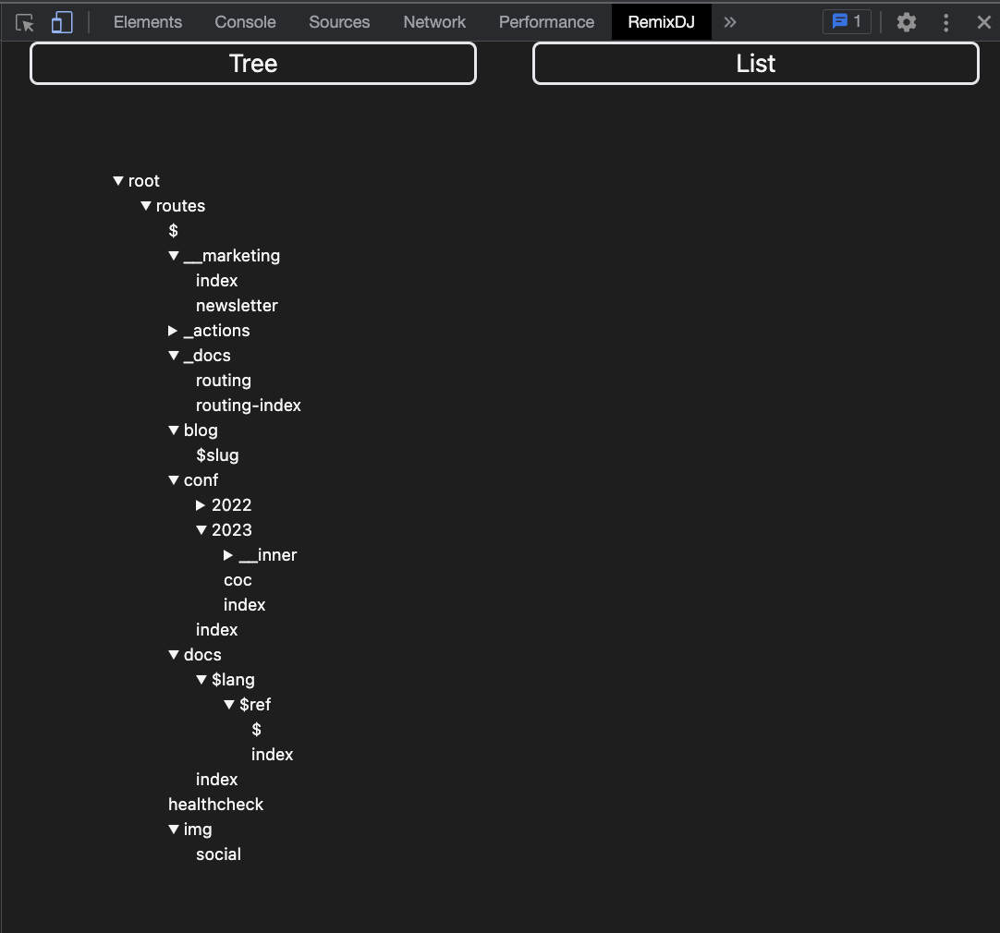

# Remix DJ

Intro

## Installing RemixDJ

RemixDJ in the Chrome store soon!

Until then:

- Clone our repo 🧬
- Navigate to the chrome-extension folder and npm install 📀
- Within the chrome-extension folder execute npm run build 🔨
- In Chrome's extensions drop-down, navigate to "Manage Extensions" 🧩
- Turn on "Developer mode" 🧑‍💻
- In "Load Unpacked" select the remixDJ/chrome-extension/build folder 📦

## Using RemixDJ

- Right click and select "Inspect" on any webpage 🔎
- In the nav bar, navigate to RemixDJ 🗺️

## Features

- Visualize Remix sites as a tree or list 🌳
- Choose between visualizing layout nesting and URL nesting 📊
- Watch the logo change to bright colors if a site is using remix 🎨

🌲

📂

## The Team

Adam Liang 👨‍🔧

- <https://github.com/adamsherpa>
- <https://www.linkedin.com/in/adam-labs/>

Matt Jackson 🐟

- <https://github.com/Mjax511>

Molly Greene 👨‍🎤

- <https://github.com/mollycgreene>
- <https://www.linkedin.com/in/mollycgreene>

Tim Muller &#x1F43F;

- <https://github.com/tmuller23>
- <https://www.linkedin.com/in/timothy-muller-a0800b155/>

Victoria Dillman 🌻

- <https://github.com/victoriadillman>
- <https://www.linkedin.com/in/victoria-dillman/>
