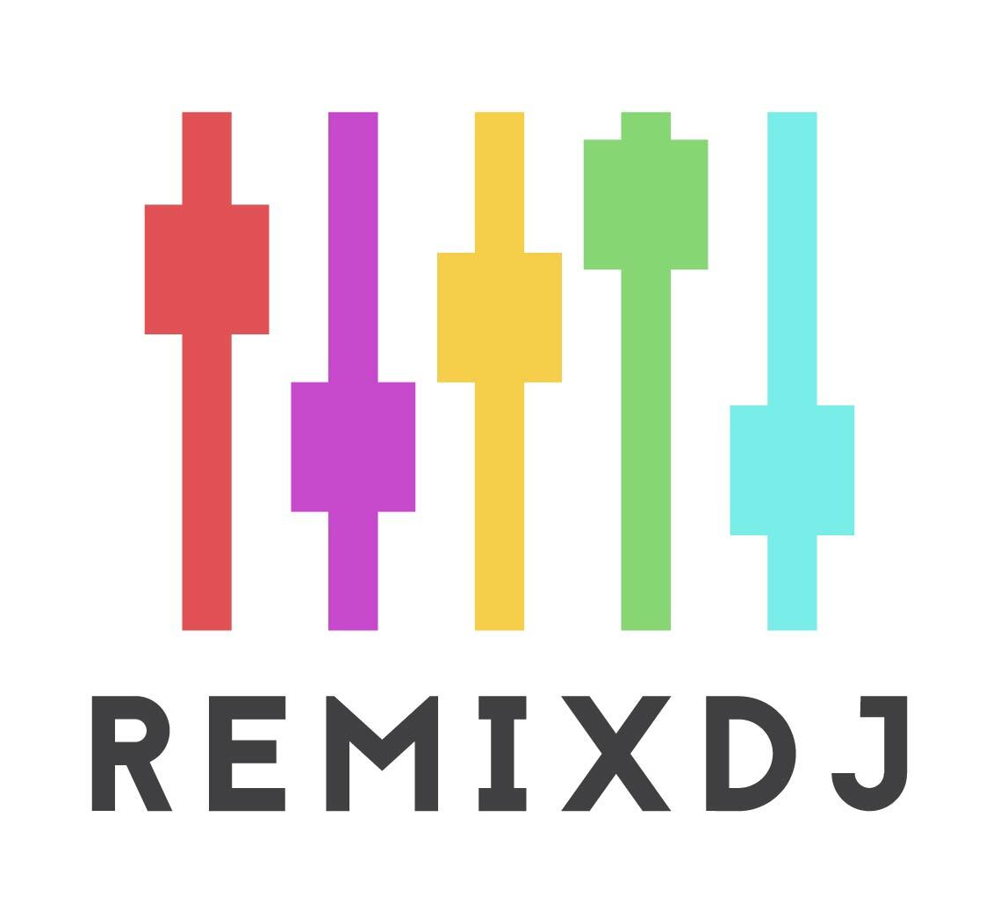

# Remix DJ

Intro

## Installing RemixDJ 

RemixDJ in the Chrome store soon!

Until then:
- Clone our repo
- In Chrome's extensions drop-down, navigate to "Manage Extensions"
- Turn on "Developer mode"
- In "Load Unpacked" select the remixDJ/chrome-extension/build folder

## Using RemixDJ

- Right click and select "Inspect" on any webpage
- In the nav bar, navigate to RemixDJ

## Features

- View sites nested layout or URL structure as a tree, list, or raw data

## Team

Adam Liang
- https://github.com/adamsherpa
- https://www.linkedin.com/in/adam-labs/ 

Matt Jackson
- https://github.com/Mjax511

Molly Greene
- https://github.com/mollycgreene
- https://www.linkedin.com/in/mollycgreene 

Tim Muller
- https://github.com/tmuller23
- https://www.linkedin.com/in/timothy-muller-a0800b155/ 

Victoria Dillman
- https://github.com/victoriadillman 
- https://www.linkedin.com/in/victoria-dillman/ 